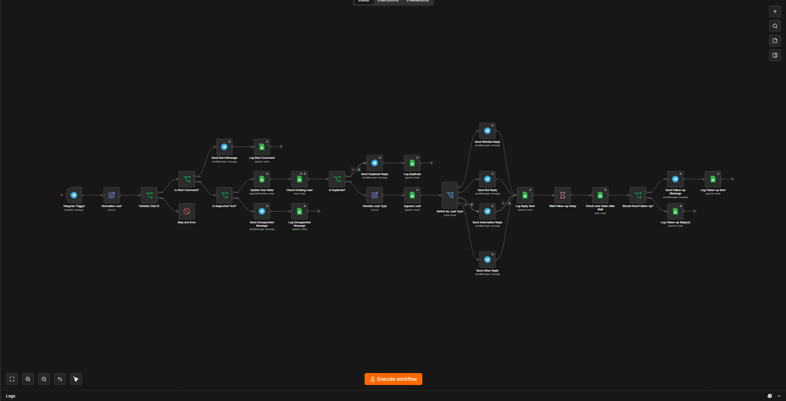
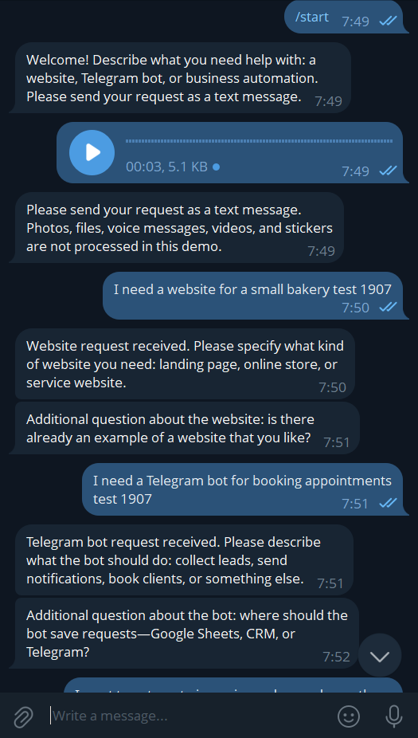
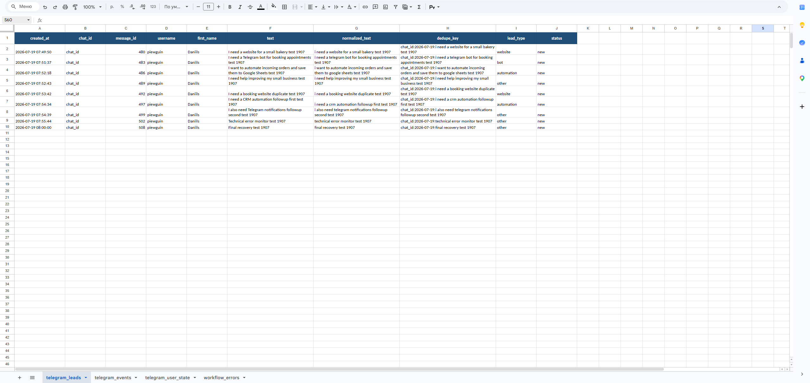
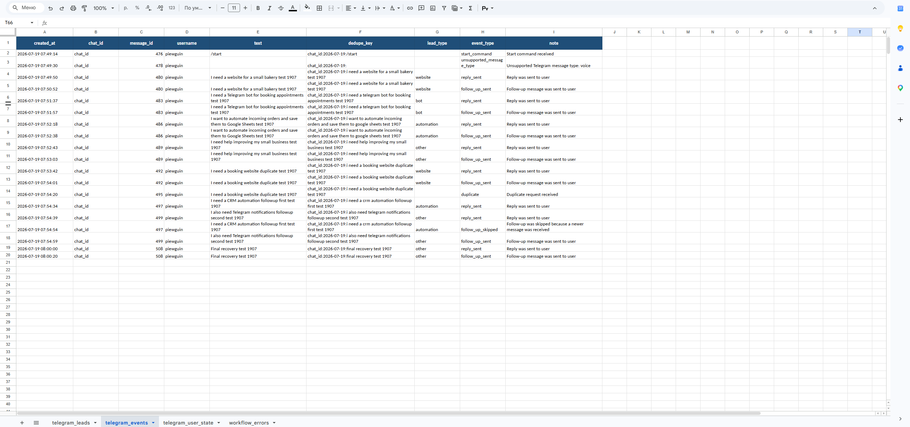
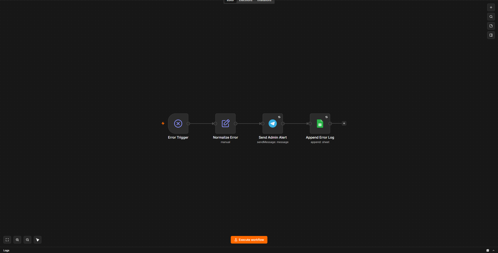
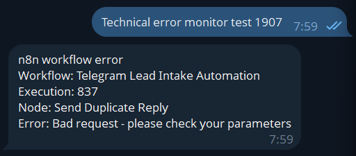

# Telegram Lead Intake Automation with n8n

A portfolio project demonstrating a Telegram-based lead intake automation built with **n8n**, **Telegram Bot API**, and **Google Sheets**.

The workflow receives client requests from Telegram, validates and normalizes the data, prevents duplicate submissions, classifies the lead type, stores the lead in Google Sheets, sends contextual replies, sends delayed follow-ups, skips follow-ups if the user already replied, and includes a separate error monitoring workflow with admin alerts.

---

## Project Overview

This project solves a common small-business automation problem:

> A business receives requests in Telegram, but leads can be missed, duplicated, or left without follow-up. There is also no clear error monitoring when automation fails.

The solution is an n8n workflow that automates the full lead intake process and stores all key data in Google Sheets.

---

## Demo

### Main workflow



### Telegram conversation



### Lead and event logs





### Error monitoring





---

## Features

* Telegram lead intake
* Required field validation
* Lead normalization
* Duplicate protection using `dedupe_key`
* Lead classification by request type:

  * `website`
  * `bot`
  * `automation`
  * `other`
* Google Sheets lead storage
* Event logging
* Dynamic Telegram replies based on lead type
* Delayed follow-up messages
* Follow-up skip if the user already replied
* Retry logic for external service calls
* Controlled error handling with `Stop and Error`
* Separate Error Workflow
* Telegram admin alerts for failed executions

---

## Tech Stack

* n8n
* Telegram Bot API
* Google Sheets
* n8n Error Workflow
* n8n Wait node
* n8n Switch node
* n8n IF node
* n8n Set / Edit Fields node

---

## Workflow Files

The repository contains sanitized n8n workflow exports:

```text
workflows/
├── telegram-lead-intake-automation.json
└── telegram-lead-intake-error-monitor.json
```

Sensitive values such as credentials, Google Sheet IDs, webhook IDs, and private chat IDs are replaced with placeholders.

---

## Main Workflow Structure

```text
Telegram Trigger
→ Normalize Lead
→ Validate Chat ID
→ Is Start Command?

Command branch:
  → Send Start Message
  → Log Start Command

Non-command branch:
  → Is Supported Text?
      → Unsupported: Send Unsupported Message → Log Unsupported Message
      → Supported: continue to text lead branch

Text lead branch:
→ Update User State
→ Check Existing Lead
→ Is Duplicate?

Duplicate branch:
  → Send Duplicate Reply
  → Log Duplicate

New lead branch:
  → Classify Lead Type
  → Append Lead
  → Switch by Lead Type
      → Send Website Reply
      → Send Bot Reply
      → Send Automation Reply
      → Send Other Reply
  → Log Reply Sent
  → Check User State Before Wait
  → Wait Follow-up Delay
  → Check User State After Wait
  → Should Send Follow-up?
      → Send Follow-up Message
      → Log Follow-up Sent
      OR
      → Log Follow-up Skipped
```

---

## Error Workflow Structure

```text
Error Trigger
→ Normalize Error
→ Send Admin Alert
→ Append Error Log
```

The Error Workflow is connected to the main workflow and sends a Telegram alert when the main workflow fails.

---

## Google Sheets Structure

The project uses the following sheets:

### `telegram_leads`

Stores accepted leads.

| Column            | Description                         |
| ----------------- | ----------------------------------- |
| `created_at`      | Lead creation timestamp             |
| `chat_id`         | Telegram chat ID                    |
| `message_id`      | Telegram message ID                 |
| `username`        | Telegram username                   |
| `first_name`      | Telegram first name                 |
| `text`            | Original message text               |
| `normalized_text` | Lowercase normalized message        |
| `dedupe_key`      | Unique key for duplicate protection |
| `lead_type`       | Classified lead type                |
| `status`          | Lead status                         |

### `telegram_events`

Stores workflow events.

| Column       | Description        |
| ------------ | ------------------ |
| `created_at` | Event timestamp    |
| `chat_id`    | Telegram chat ID   |
| `message_id` | Telegram message ID |
| `username`   | Telegram username  |
| `text`       | Original lead text |
| `dedupe_key` | Related dedupe key |
| `lead_type`  | Lead type          |
| `event_type` | Event type         |
| `note`       | Event note         |

Example event types:

```text
reply_sent
follow_up_sent
follow_up_skipped
duplicate
start_command
unsupported_message
```

### `telegram_user_state`

Stores the latest user state used to decide whether a follow-up should be sent.

| Column            | Description             |
| ----------------- | ----------------------- |
| `chat_id`         | Telegram chat ID        |
| `username`        | Telegram username       |
| `last_message_id` | Latest Telegram message ID |
| `last_message_at` | Last message timestamp  |
| `last_text`       | Last user message       |
| `last_dedupe_key` | Last message dedupe key |

### `workflow_errors`

Stores failed workflow executions.

| Column               | Description                   |
| -------------------- | ----------------------------- |
| `created_at`         | Error timestamp               |
| `workflow_name`      | Failed workflow name          |
| `workflow_id`        | Failed workflow ID            |
| `execution_id`       | Failed execution ID           |
| `error_node`         | Node where the error happened |
| `error_message`      | Error message                 |
| `error_stack`        | Error stack trace             |
| `last_node_executed` | Last executed node            |
| `mode`               | Execution mode                |

---

## Test Scenarios

### 1. Website lead

Input:

```text
I need a website for a coffee shop
```

Expected result:

```text
lead_type = website
event_type = reply_sent
```

### 2. Bot lead

Input:

```text
I need a Telegram bot for client bookings
```

Expected result:

```text
lead_type = bot
event_type = reply_sent
```

### 3. Automation lead

Input:

```text
I need automation for leads in Google Sheets and CRM
```

Expected result:

```text
lead_type = automation
event_type = reply_sent
```

### 4. Other lead

Input:

```text
Hello, I want to discuss a project
```

Expected result:

```text
lead_type = other
event_type = reply_sent
```

### 5. Duplicate lead

Input:

```text
I need a website for a coffee shop
```

Send the same message again.

Expected result:

```text
No new lead row is created
event_type = duplicate
Duplicate reply is sent
```

### 6. Follow-up skip

Input:

```text
I need a bot for a school
```

Then send another message before the follow-up delay ends:

```text
It should save requests to Google Sheets
```

Expected result:

```text
The original follow-up is skipped
event_type = follow_up_skipped
```

### 7. Follow-up sent

Send a supported text message and do not reply during the configured delay.

Expected result:

```text
Follow-up message is sent
event_type = follow_up_sent
```

### 8. Start command

Send `/start`.

Expected result:

```text
Welcome message is sent
No lead row is created
```

### 9. Unsupported message

Send a photo, voice message, file, or sticker without supported text.

Expected result:

```text
User is asked to send text
No lead row is created
Workflow does not fail
```

### 10. Error workflow

Trigger a controlled error using `Stop and Error`.

Expected result:

```text
Error is logged in workflow_errors
Admin alert is sent to Telegram
```

---

## Setup Notes

To use this workflow:

1. Import the sanitized workflow JSON files into n8n.
2. Configure your own Telegram credentials.
3. Configure your own Google Sheets credentials.
4. Create the required Google Sheets tabs:

   * `telegram_leads`
   * `telegram_events`
   * `telegram_user_state`
   * `workflow_errors`
5. Replace placeholder values with your own IDs.
6. Set the timezone of both workflows to `Europe/Riga` after import if your n8n version does not preserve it.
7. In the main workflow settings, select `Telegram Lead Intake — Error Monitor` as the Error Workflow.
8. Keep the follow-up delay at 10 minutes.
9. Activate the main workflow.

---

## Security Notes

This repository contains sanitized workflow exports.

The following values are intentionally replaced with placeholders:

* Telegram credentials
* Google Sheets credentials
* Google Sheet IDs
* Telegram chat IDs
* Webhook IDs
* Internal n8n instance IDs

Do not commit real credentials, private chat IDs, production spreadsheet links, or client data.

---

## Limitations

This project is designed as a small-business lead intake automation demo.

Current limitations:

* Google Sheets is used as a lightweight storage layer, not a production database.
* Lead classification is keyword-based.
* It does not implement a full multi-step conversational CRM state machine.
* Telegram message retry can theoretically send a duplicate message if the original request succeeds but n8n receives a timeout.

---

## Possible Improvements

Future improvements could include:

* Replacing keyword classification with AI-based classification
* Adding full conversation state management
* Adding CRM integration
* Adding email notifications
* Adding manager assignment by lead type
* Replacing Google Sheets with a database
* Adding a dashboard for lead statistics

---

## Project Status

Completed as a portfolio project.

Main tested scenarios:

```text
/start — ok
unsupported message — ok
website — ok
bot — ok
automation — ok
other — ok
duplicate — ok
follow-up sent — ok
follow-up cancelled — ok
controlled technical error — ok
Telegram admin alert — ok
workflow_errors log — ok
```
